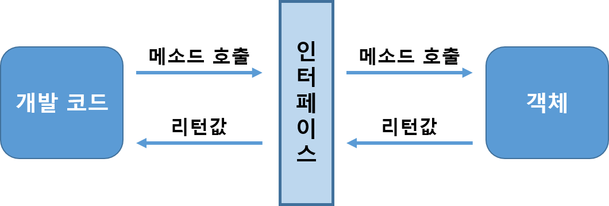
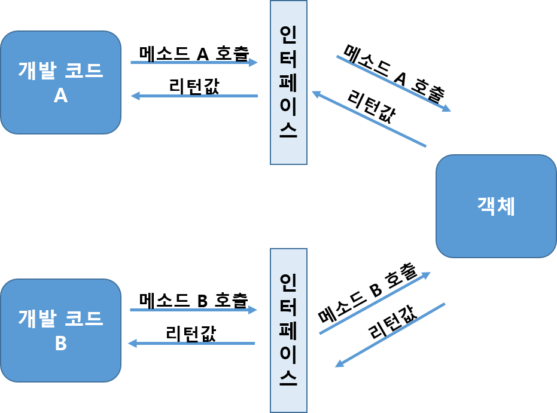
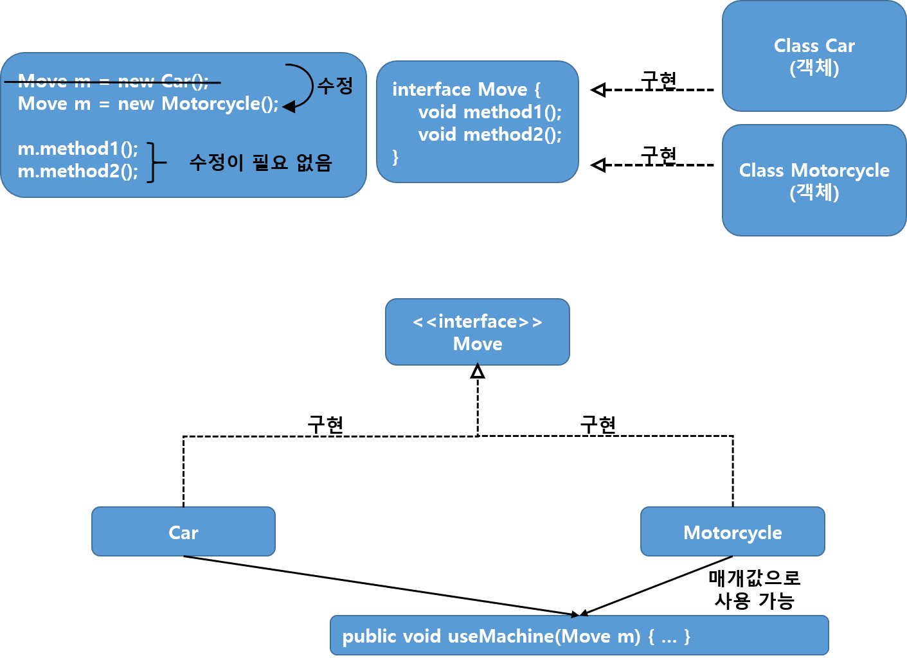
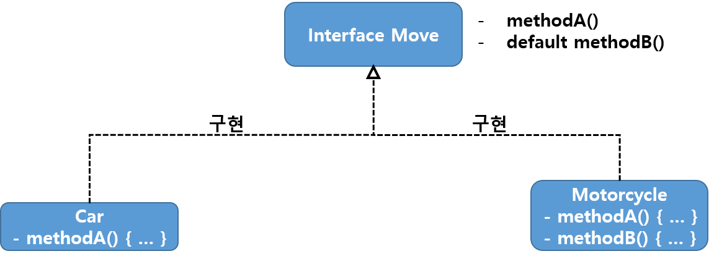

# Interface(인터페이스)
* 객체의 사용 방법을 정의한 타입을 말한다
* 객체의 교환성을 높여주기 때문에 **다형성을 구현하는 매우 중요한 역할이다**
* 자바 인터페이스는 추상메서드의 모음이다
* 여러 구현체에서 공통적인 부분을 추상화 한것이다(다형성)
* 개발 코드와 객체가 서로 통신하는 접점 역할
* 객체의 내부 구조를 알 필요가 없고 인터페이스의 메소드만 알고 있으면 된다



* 개발 코드가 직접 객체의 메소드를 호출하지 않고 **인터페이스를 사용하는 이유** 는 객체 내부에 메소드를 직접 구현했다면 상황에 따라 개발 코드를 수정해야 하는 일이 발생할 수 있지만
* 인터페이스를 통해 **개발 코드를 수정하지 않고 사용하는 객체를 변경할 수 있도록 하기 위해서** 이다
* 인터페이스는 하나의 객체가 아니라 여러 객체들과 사용이 가능하므로 어떤 객체를 사용하느냐에 따라 실행 내용과 리턴값이 다를 수 있다
* 따라서 개발코드 측면에서 코드 변경 없이 실행 내용과 리턴값을 다양화 할 수 있다는 장점을 갖게 된다

## 인터페이스 선언
### 인터페이스 선언
* interface 키워드를 사용하여 인터페이스를 만든다

```java
public interface InterfaceName {
  // constant
  typeName constantName = value;
  
  // abstract method
  typeName methodName(parameter1, ...);
  
  // default method
  default typeName methodName(parameter1, ...){
    // ...
  };
  
  // static method
  static typeName methodName(parameter1, ...){
    // ...
  };
}
```

* 인터페이스는 `상수와 메소드만을 구성멤버로 갖는다`
* 자바7 이전까지는 추상 메소드만 선언이 가능했지만, 자바8부터는 디폴트 메소드와 정적 메소드도 선언이 가능하다

* **Consstant Field**
  * 인터페이스 내에 데이터를 저장할 수 있는 필드 선언은 안되지만 상수 필드는 선언이 가능하다
  * [public static final] typeName fieldName = value; // public static final을 생략하더라도 컴파일 과정에서 생성해준다
  * static {} 블록으로 초기화할 수 없기 때문에 반드시 선언과 동시에 초기값을 지정해야 한다
* **Astract Method**
  * 구현부가 없는 메소드이다(→ 구현객체가 실제 실행부르르 갖는다)
  * 인터페이스를 구현하기로 한 클래스는 반드시 인터페이스에 명시되어 있는 모든 추상메서드들을 구현해야 한다
  
  ```java
  public interface Walkable {
    public void walk();
    public void run();
  }
  ```
  ```java
  public class Dog implements Walkable {
    @Override
    public void walk() {
      // ...
    }

    @Override
    public void run() {
      // ...
    }
  }
  ```
  
* **Default Method**
  * Java 8버전 이상부터는 인터페이스에서 default 접근 제어자를 사용할 수 있다 → 기존 인터페이스를 확장해서 새로운 기능을 추가하기 위함
  * public default returnType method1(paramter1, ...) { ... } → public은 생략 가능하며 compile 과정에서 생성해준다
  * 실제 구현내용까지 작성
  * 실제 구현내용이 작성되어 있지만 Override를 통해서 재작성 할 수 있다
  * 라이브러리를 업데이트 할 때, 인터페이스에 추가된 기능이 있다면 구현한 클래스 역시 해당 메소드를 구현해주어야 하지만 사용자가 해당 인터페이스를 사용하면서 메소드를 구현하지 않아 컴피일 에러가 발생할 것이다
  * 이러한 불편함을 해소하기 위해 default 키워드를 지원하였다

* **Static Method**
  * Java 8버전 이상부터는 인터페이스에서 static 접근 제어자를 사용할 수 있다
  * public static returnType method1(paramter1, ...) { ... } → public은 생략 가능하며 compile 과정에서 생성해준다

```java
public interface RemoteControl {
  // 상수
  int MAX_VOLUME = 10;
  int MIN_VOLUME = 0;

  // 추상 메소드
  void turnOn();
  void turnOff();
  void setVolume(int volume);

  // 디폴드 메소드
  default void setMute(boolean mute) {
    if(mute) {
      System.out.println("무음 처리합니다.");
    } else {
      System.out.println("무음 해제합니다.");
    }
  }

  // 정적 메소드
  static void changeBattery() {
    System.our.println("건전지를 교환합니다.");
  }
}
```


### 인터페이스 구현
* `인터페이스 구현 객체`란 인터페이스에서 정의된 추상 메소드와 동일한 메소드 이름, 매개 타입, 리턴 타입을 가진 실체 메소드를 가지고 있는 객체를 말한다
* 구현 객체를 생성하는 클래스를 `구현 클래스`라고 한다

      public class ClassName implements InterfaceName {
        // 인터페이스에 선언된 추상 메소드 구현
      }
    
```java
public class BMW immplenments Car {
  @Override
  public String getManufacturer() {
    return "BMW";
  }
  
  @Override
  public String getSeries() {
    return "The new 5";
  }
}
```

* 인터페이스의 모든 메소드는 기본적으로 public 접근제한자를 갖기 때문에 public보다 낮은 접근 제한으로 작성 할 수 없다
* public을 생략하면 "Cannot reduce the visibility of the inherited method"라는 컴파일 에러가 발생한다
* 인터페이스의 추상 메소드를 작성하지 않는다면 구현 클래스는 자동으로 추상클래스가 되기 때문에 **abstract** 키워드를 추가해야한다
* 자동 생성된 실체 메소드는 **@Override** 가 붙는데  인터페이스의 추상 메소드에 대한 정확한 실체 메소드인지 컴파일러가 체크하도록 지시하는 어노테이션이다
* 또한, 인터페이스는 상속과 달리 다중 인터페이스를 지원한다

    public abstract class ClassName implements InterfaceName {
      public void method1() {};
    }

* 구현 클래스가 작성되면 new 연산자로 객체를 생성할 수 있다
* 여기서 어떤 타입의 변수에 대입하냐면 인터페이스 변수를 선언하고 구현객체를 대입해야한다

```java
public class RemoteControlExample {
  public static void main(String[] args) {
    RemoteControl rc;
    rc = new Television();
    rc = new Audio();
  }
}
```

* RemoteControl 인터페이스로 구현 객체인 Television과  Audio를 사용하는 방법이다
* RemoteControl rc = new Television(); 과 같이 사용가능하다

### 익명 구현 객체
* **일회성의 구현 객체** 를 위해 소스 파일을 만들고 클래스를 선언하는 것은 비효율적이다
* 따라서 소스파일을 만들지 않고 구현 객체를 만들 수 있는 방법을 제공하는 것이 익명 구현 객체 이다
* 하나의 실행문이므로 끝에 세미콜론을 붙여야한다

      InterfaceName varName = new InterfaceName() {
        // 인터페이스에 선언된 추상 메소드 구현
      };

* 인터페이스(){}는 인터페이스를 구현해서 중괄호{}와 같이 클래스를 성넝ㄴ하라는 뜻이고, new 연산자는 이렇게 선언된 클래스를 객체로 생성한다
* 
    
```java
public interface Car {
  int MAX_SPEED = 230;
  void getManufacturer();
}

public class Sedan {
  public static void main(String[] args) {
    Car car = new Car() {
      public void getManufacturer() {
        // 구현
      }
    };
  }
}
```

### 다중 인터페이스 구현 클래스
* 인터페이스 A와 인터페이스 B가 객체의 메소드를 호출할 수 있으려면 객체는 이 두 인터페이스를 모두 구현해야 한다
* 다중 인터페이스를 구현할 경우, 구현 클래스는 모든 인터페이스의 추상 메소드에 대해 실체 메소드를 작성해야 한다
* 만약 하나라도 없으면 추상 클래스로 선언해야 한다

```java
public interface RemoteControl { ... }
public interface Searchable { ... }

public class SmartTelevision implements RemoteControl, Searchable {
  private int volume;

  // RemoteControl 인터페이스의 추상메소드에 대한 실체 구현
  @Override
  public void turnOn() {
    System.out.println("TV를 켭니다");
  }

  @Override
  public void turnOff() {
    System.out.println("TV를 끕니다");
  }

  @Override
  public void setVolume(int volume) {
    if(volume > RemoteControl.MAX_VOLUME) {
      this.volume = RemoteControl.MAX_VOLUME;
    } else if (volume < RemoteControl.MIN_VOLUME) {
      this.volume = RemoteControl.MIN_VOLUME;
    } else {
      this.volume = volume;
    }
  }

  // Searchable 인터페이스의 추상메소드에 대한 실체 구현
  @Override
  puvlic void search(String url) {
    System.out.println(url + "을 검색합니다");
  }
}
```



</br>

## 인터페이스 사용
* 인터페이스로 구현 객체를 사용하려면 인터페이스 변수를 선언하고 구현 객체를 대입해야 한다
* 인터페이스 변수는 참조 타입이기 때문에 구현 객체가 대입될 경우 구현 객체의 번지를 저장한다

    인터페이스 변수 = 구현객체;

* 인터페으스는 아래와 같이 클래스의 필드, 생성자, 메소드의 매개변수, 매소드의 로컬변수로 선언 될 수 있다

```java
public class MyClass {
  // 1. 필드
  RemoteControl rc = new Television();
  
 // 2. 생성자
  MyClass(RemoteControl rc) {
    this.rc = rc;
  }
  
  // 3. 메소드
  void methodA() {
    // 4. 로컬 변수
    RemoteControl rc = enw Audio();
  }
  
  void methdB(RemoteControl rc) {
  }
}
```

### 추상 메소드 사용
* 구현 객체가 인터페이스 타입에 대입되면 인터페이스에 선언된 추상 메소드를 개발 코드에서 호출할 수 있게 된다

```java
public interface MachineMotion {
  int MAX_SPEED = 340;
  int MIN_SPEED = 0;

  public void goStraight();
  public void machineStop();
  public void setSpeed(int speed);
}

public class Car interface MachineMotion {
  int speed = 120;

  @Override
  public void goStraight() {
    System.out.println("자동차가 전진합니다.");
  }

  @Override
  public void machineStop() {
    System.out.println("자동차가 정지합니다.");
  }

  @Override
  public void setSpeed(int speed) {
    if(speed > MachineMotion.MAX_SPEED) {
      this.speed = MachineMotion.MAX_SPEED;
    } else if (speed < MachineMotion.MIN_SPEED) {
      this.speed = MachineMotion.MIN_SPEED;
    } else {
      this.speed = speed;
    }
    System.out.println("현재 속도는 " + speed + "km/h 입니다.");
  }
}

public class Motorcycle interface MachineMotion {
  @Override
  public void goStraight() {
    System.out.println("오토바이가 전진합니다.");
  }

  @Override
  public void machineStop() {
    System.out.println("오토바이가 정지합니다.");
  }

  @Override
  public void setSpeed(int speed) {
    if(speed > MachineMotion.MAX_SPEED) {
      this.speed = MachineMotion.MAX_SPEED;
    } else if (speed < MachineMotion.MIN_SPEED) {
      this.speed = MachineMotion.MIN_SPEED;
    } else {
      this.speed = speed;
    }
    System.out.println("현재 속도는 " + speed + "km/h 입니다.");
  }
}
```

```java
public class CarExample {
  public static void main(Stringp[] args) {
    MachineMotion mm;

    mm = new Car(); // Car 객체를 인터페이스 타입에 대입

    // Car 클래스에서 정의한 실체화 된 추상메소드를 호출
    mm.goStraight();
    mm.machineStop();

    mm = new Motorcycle();  // Motorcycle 객체를 인터페이스 타입에 대입

    // Motorcycle 클래스에서 정의한 실체화 된 추상메소드를 호출
    mm.goStraight();
    mm.machineStop();
  }
}

/*****************************
 * Output : 
 * 자동차가 전진합니다.
 * 자동차가 정지합니다.
 * 오토바이가 전진합니다.
 * 오토바이가 정지합니다.
 ****************************/
```

### 디폴트 메소드 사용
* 디폴트 메소드는 인터페이스의 모든 구현 객체가 가지고 있는 기본 메소드라고 생각하면 된다
* 구현 클래스를 작성할 때 디폴트 메소드를 재정의 해서 자신에게 맞게 수정하면 디폴트 메소드가 호출 할 때 자신을 재정의한 메소드가 호출된다

### 정적 메소드 사용
* 정적 메소드는 인터페이스로 바로 호출이 가능하다

```java
public class RemoteControlExample {
  public static void main(String[] args) {
    RemoteControl.changeBattery();
  }
}
```


</br>

## 타입 변환과 다형성
* 부모 타입에 어떤 자식 객체를 대입하느냐에 따라 실행 결과가 달라지듯이, 인터페이스 타입에 어떤 구현 객체를 대입하냐에 따라 실행 결과가 달라진다
* 상속은 같은 종류의 하위 클래스를 만드는 기술이고, 인터페이스는 사용 방법이 동일한 클래스를 만드는 기술이라는 개념적 차이점은 있지만
* 둘 다 다형성을 구현하는 기술이다



### 자동 타입 변환
* 구현 객체가 인터페이스 타입으로 변환되는 것을 말한다

### 필드와 매개 변수의 다형성
* 인터페이스를 통해 공통 기능을 구현하고 이를 각 클래스들이 인터페이스를 상속받아 실체화 시켜 사용한다

```java
// 필드의 다형성
public class CarExample {
  public static void main(Stringp[] args) {
    MachineMotion mm;
    mm = new Car(); // Car 객체를 인터페이스 타입에 대입
    mm = new Motorcycle();  // Motorcycle 객체를 인터페이스 타입에 대입
  }
}

// 매개 변수의 다형성
public interface Vehicle {
  public void run();
}

public class Driver {
  puvlic void drive(Vehicle vehicle) {
    vehicle.run();
  }
}

public class Bus interface Vehicle{
  @Override
  public void run() {
    System.out.println("버스가 달린다.");
  }
}
public class Taxi interface Vehicle{
  @Override
  public void run() {
    System.out.println("택시가 달린다.");
  }
}

public class Example {
  public static void main(String[] args) {
    Driver driver = new Driver();
    Bus bus = new Bus();
    Taxi taxi = new Taxi();
    driver.drive(bus);
    driver.drive(taxi);
  }
}

/*****************************
 * Output : 
 * 버스가 달린다.
 * 택시가 달린다.
 ****************************/
```


### 인터페이스 배열로 구현 객체 관리
```java
Tire[] tires = {
  new HankookTire(),
  new HankookTire(),
  new HankookTire(),
  new HankookTire(),
};

frontLeftTire = tires[0];
frontRightTire = tires[1];

// 만약 KumhoTire()로 교체하려면
tires[2] = new KumhoTire();

// 배열로 관리하게 되면 제어문에서 가장 많은 혜택을 본다
void run() {
  for(Tire tire : tires) {
    tire.roll();
  }
}
```

### 강제 타입 변환
* 구현 객체가 인터페이스 타입으로 자동 변환하면, 인터페이스에 선언된 메소드만 사용 가능하다는 제약 사항이 따른다
* 하지만 경우에 따라서 구현 클래스에 선언된 필드와 메소드를 사용해야 할 경우도 발생한다
* 이때 강제 타입 변환을 해서 다시 구현 클래스 타입으로 변환한 다음, 구현 클래스의 필드와 메소드를 사용할 수 있다

        구현클래스 변수 = (구현클래스) 인터페이스변수;

### 객체 타입 확인(instanceof)
* 구현 클래스 타입이 다른 클래스로 강제 타입 변환을 하게 된다면 ClassCastException이 발생한다
* 오류방지를 위해 instanceof 연산자를 통해 타입ㅇ을 확인하고 안전하게 강제 타입 변환을 해야한다

</br>

## 인터페이스 상속
* 인터페이스도 다른 인터페이스를 상속할 수 있다.
* 인터페이스는 클래스와 달리 다중 상속을 허용한다

        public interface 하위인터페이스 extends 상위인터페이스1, 상위인터페이스2 { ... }

* 하위 인터페이스를 구현하는 클래스는 하위 인터페이스가 상속하고 있는 상위인터페이스까지 실체화 시켜 구현해야한다
* InterfaceA(부모A)와 InterfaceB(부모B)를 InterfaceC(자식C)가 상속받고 있으며
* 이 InterfaceC를 상속받아 구현한 ClassC가 있다면
* InterfaceA와 InterfaceB 변수는 각 본인 인터페이스에 있는 메소드(methodA(), methodB())만 호출이 가능하다
* InterfaceC 변수만이 모든 인터페이스에 있는 메소드를 사용할 수 있다

</br>

##  디폴트 메소드와 인터페이스 확장
* 인터페이스에서 디폴트 메소드를 허용한 이유는 기존 인터페이스를 확정해서 새로운 기능을 추가하기 위해서이다



</br>

* 부모 인터페이스에 디폴드 메소드가 정의되어 있을 경우, 자식 인터페이스에서 디폴트 메소드를 활용하는 방법

  1. 디폴트 메소드를 단순히 상속만 받는다
  2. 디폴트 메소드를 재정의(Override)해서 실행 내용을 변경한다
  3. 디폴트 메소드를 추상 메소드로 재선언한다

</br></br>

### Reference
> 이것이 자바다 - 신용권 지음</br>
[점프 투 자바 - 인터페이스](https://wikidocs.net/217)</br>
[SungBum Park - 인터페이스](https://velog.io/@codemcd/%EC%9D%B8%ED%84%B0%ED%8E%98%EC%9D%B4%EC%8A%A4Interface)
