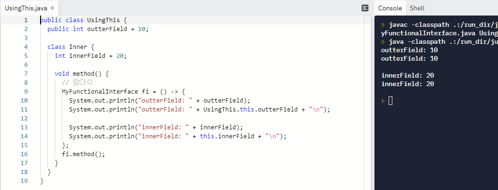

## 람다식이란?

- 람다식은 익명 함수를 생성하기 위한 식으로 객체 지향 언어보다는 함수 지향 언어에 가깝다
- 람다식의 형태는 매개 변수를 가진 코드 블록이지만, 런타임 시에는 익명 구현 객체를 생성한다
    
    ```java
    람다식 -> 매개변수를 가진 코드 블록 -> 익명 구현 객체
    ```
    
    ```java
    // 익명 구현 객체
    Runnable runnable = new Runnable {
    	public void run() { ... }
    };
    
    // 익명 구현 객체를 람다식으로 표현
    Runnable runnable = () -> { ... };
    ```
    

## 람다식 기본 문법

```java
(타입 매개변수, ...) -> { 실행문; ... }
```

```java
// int 매개변수 a의 값을 출력하는 람다식 작성
(int a) -> { System.out.println(a); }
(a) -> { System.out.println(a); }     // 런타임 시에 대입되는 값에 따라 자동으로 인식될 수 있기 때문에 람다식에서는 매개변수
a -> System.out.println(a);           // 매개변수가 하나인 경우, 괄호()를 생략할 수 있다
                                      // 실행문이 하나인 경우, 중괄호{}를 생략할 수 있다

// 매개변수가 없는 경우
() -> { 실행문; ... }

// 중괄호{}에 return만 있는 경우, 람다식에서는 return문을 사용하지 않는 것이 정석이다
(x, y) -> x + y
```

## 타겟 타입과 함수적 인터페이스

- 람다식은 익명 구현 클래스를 생성하고 객체화 한다
- 람다식이 대입될 인터페이스를 람다식의 타겟 타입이라고 한다

### 함수적 인터페이스(@FunctionalInterface)

- 람다식은 하나의 메소드를 정의하기 때문에 두 개 이상의 추상 메소드가 선언된 인터페이스는 람다식을 이용해서 구현 객체를 생성할 수 없다
- 하나의 추상 메소드가 선언된 인터페이스만 람다식의 타겟 타입이 될 수 있고 이것을 함수적 인터페이스라고 한다
- @FunctionalInterface 어노테이션을 붙이면 두 개 이상의 추상 메소드가 선언되면 컴파일 오류가 발생한다

### 매개 변수와 리턴값이 없는 람다식

```java
// 함수적 인터페이스
@FunctionalInterface
public interface MyFunctionalInterface {
	public void method();
}

// 람다식 작성
MyFunctionalInterface fi = () -> { ... }

// 참조변수 사용
fi.method();
```

### 매개 변수가 있는 람다식

```java
// 함수적 인터페이스
@FunctionalInterface
public interface MyFunctionalInterface {
	public void method(int x);
}

// 람다식 작성
MyFunctionalInterface fi = (x) -> { ... } 또는 x -> { ... }

// 참조변수 사용
fi.method(1);
```

### 리턴값이 있는 람다식

```java
// 함수적 인터페이스
@FunctionalInterface
public interface MyFunctionalInterface {
	public int method(int x, int y);
}

// 람다식 작성
MyFunctionalInterface fi = (x, y) -> sum(x, y);

// 참조변수 사용
int result = fi.method(2, 6);
```

</br>

## 클래스 멤버와 로컬 변수 사용
### 클래스의 멤버 사용
* 클래스의 멤버인 필드와 메소드를 제약 사향 없이 사용할 수 있다
* 람다식에서 this는 람다식을 실행한 객체의 참조이다



- 익명 객체 내부에서의 this는 익명객체를 참조
- 람다식에서 this는 내부적으로 생성되는 익명객체의 참조가 아니라 `람다식을 실행한 객체의 참조`이다
- `UsingThis.this.outterField`는 바깥 객체의 참조를 얻기위해 클래스명.this를 이용
- `this.innerField`는 람다식을 실행한 Inner 객체를 참조

### 로컬 변수 사용

- 람다식에서 바깥 클래스의 필드나 메서드는 제한 없이 사용할 수 있으나, 메소드의 매개 변수 또는 로컬 변수를 사용하면 이 두 변수는 final특성을 가져야 한다
- 왜냐하면, 메소드 실행이 종료되면 매개 변수 또는 로컬 변수는 메모리의 스택 영역에서 사라지게 되지만 익명 객체는 남아 있어 해당 변수들을 사용 할 수 없게 되기 때문이다
    - 자바 8이후에는 final을 붙이지 않아도 내부적으로 final로 인식하여 사용된다

## 표준 API의 함수적 인터페이스

- 자바에서 제공되는 표준 API에서 한 개의 추상 메소드를 갖는 인터페이스들은 모두 람다식을 이용해서 익명 구현 객체로 표현이 가능하다
- 예를 들어 스레드의 작업을 정의하는 Runnable 인터페이스는 매개변수와 리턴값이 없는 run() 메소드만 존재하기 때문에 다음과 같이 람다식을 이용해서 Runnable 인스턴스를 생성시킬 수 있다
    
    ```java
    public class RunnableExample {
    	public static void main(String[] args) {
    		Runnable runnable = () -> {
    				for(int i = 0; i < 10; i++) {
    					System.out.pirntln(i);
    				}
    		};
    
    		Thread thread = new Thread(runnable);
    		thread.start();
    	}
    }
    ```

</br></br>

### Reference
> 이것이 자바다 - 신용권지음
