# 멀티 스레드
## 멀티 스레드 개념
### 1. 프로세스와 스레드
* 프로세스: 실행중인 프로그램(운영체제 정의)
* 멀티 테스킹: 두 가지 이상의 작업을 동시에 처리
* 멀티 스레드: 하나의 프로그램에 동시에 여러개의 일을 수행할수 있도록 해주는 것
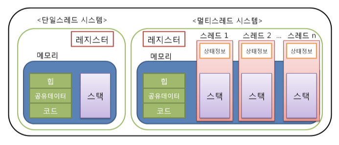

    * 멀티 스레드는 하나의 프로세스 내부에서 생성되기 때문에 하나의 스레드가 예외를 발생시켜 프로세스 자체가 종료되는 경우, 다른 스레드에도 영향을 미치게 된다

### 메인 스레드
* 모든 자바 어플리케이션은 main thread가 main() 메소드를 실행하며 시작된다

</br>

## 작업 스레드 생성과 실행
### 1. Thread 클래스로부터 직접 생성
        Thread thread = new Thread(Runnable target)

* Runnable은 인터페이스 타입으로 구현 객체를 만들어 대입해야 한다
* Runnable에는 run() 메소드 하나가 정의되어 있고 이것을 Override를 통해 작업 스레드가 실행할 코드를 작성한다
    ```java
    Thread thread = new Thread(new Runnable() {
        public void run() {
            // 스레드가 실행할 코드
        }
    });
    ```
* Runnable 인터페이스는 run() 메소드 하나만 정의되어 있기 때문에 함수적 인터페이스이다
* 따라서 람다식을 매개값으로 사용할 수 있다(자바 8부터 지원)
    ```java
    Thread thread = new Thread(() -> {
        // 스레드가 실행할 코드
    });
    ```

* 직접 생성한 스레드는 start() 메소드 호출을 통해 실행된다

**예시) 비프음을 들려주면서 동시에 문자를 출력해주기**
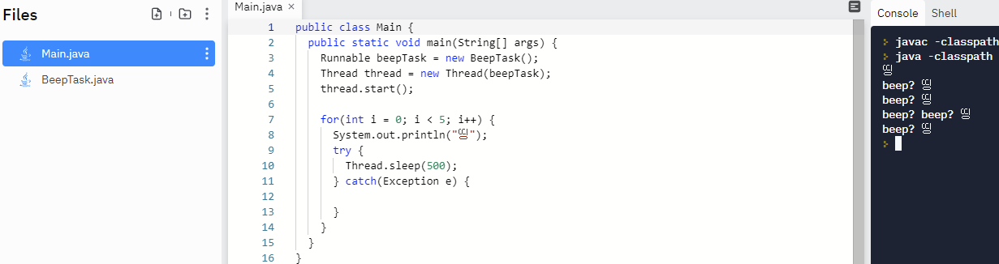

* 위 예제를 Runnable 익명 객체 또는 람다식을 이용해서 변경 가능하다

### 2. Thread 하위 클래스로부터 생성
* 작업 스레드가 실행할 작업을 Runnable로 만들지 않고, Thread의 하위 클래스로 작업 스레드를 정의하면서 작업 내용을 포함시킬 수 있다

```java
// #1
public class WorkerThread extends Thread {
    @Override
    public void run() {
        // 스레드가 실행할 코드
    }
}
Thread therad - nw WorkerThread();

// #2
Thread thread = new Thread() {
    public void run() {
        // 스레드가 실행할 코드
    }
};
```

### 3. 스레드의 이름
* 메인 스레드는 "main"이라는 이름을 갖는다
* 직접 생성한 스레드는 자동적으로 `"Thread-n"`이라는 이름이 생겨 설정된다(n은 번호이다)
* 스레드의 이름을 바꾸고 싶다면 `setName()` 메소드를 통해 변경할 수 있다
* 또한, Thread의 정적 메소드인 `currentThread()`로 코드를 실행하는 현재 스레드의 참조를 얻을 수 있다
  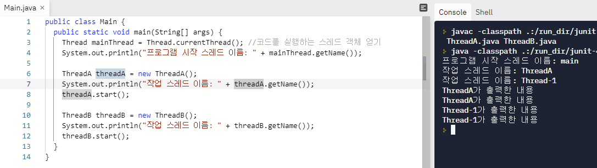

</br>

## 스레드 우선순위
* 멀티 스레드는 동시성(Concurrency) 또는 병렬성(Parallelism)으로 실행된다
  * 동시성: 멀티 작업을 위해 하나의 코어에서 멀티 쓰레드가 번갈아가며 실행하는 성질
  * 병렬성: 멀티 작업을 위해 멀티 코어에서 개별 쓰레드가 동시에 실행하는 성질

* 스레드를 어떤 순서에 의해 동시성으로 실행할 것인가를 결정하는 것이 스레드 스케줄링이다
* 스케줄링에는 두 가지 방식을 사용한다
  * 우선순위 방식: 우선순위가 높은 스레드가 실행 상태를 더 많이 가져가는 것이다</br> 스레드 객체에 우선순위를 부여할 수 있기때문에 개발자가 코드로 제어가 가능하다</br>`setPriority()`메소드를 이용해서 우선순위를 제어한다
  * 순환 할당 방식: 시간 할당량(Time slice)을 정해서 하나의 스레드가 정해진 시간만큰 실행하고 다시 다른 스레드를 실행하는 방식이다</br>JVM에 의해 정해지는 것으로 코드로 제어할 수 없다
  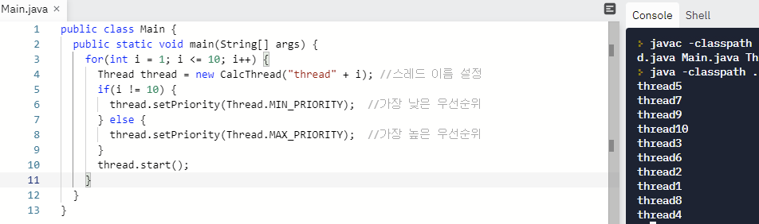
    
    * 하나의 코어에서 모두 동시성으로 실행된다면 스레드 10이 가장 빨리 끝나는 것이 맞다
    * 하지만 멀티 코어에서 병렬성으로 실행된다면 스레드10이 가장 빨리 끝나지 않을 수도 있다
    * 따라서 멀티 코어에서는 스레드 우선순위가 의마 없다
      > 이것이 자바다 Cafe - https//cafe.naver.com/thisisjava

</br>

## 동기화 메소드와 동기화 블록
### 1. 공유 객체를 사용할 때의 주의할 점
* 멀티 프로세스 기반으로 프로그래밍할 때는 프로세스 간 공유하는 자원이 없기 때문에 동일한 자원에 동시에 접근하는 일이 없었지만 멀티 쓰레딩을 기반으로 프로그래밍할 때는 이 부분을 신경써줘야 한다
* 서로 다른 쓰레드가 데이터와 힙 영역을 공유하기 때문에 어떤 쓰레드가 다른 쓰레드에서  사용중인 변수나 자료구조에 접근하여 엉뚱한 값을 읽어오거나 수정할 수 있다
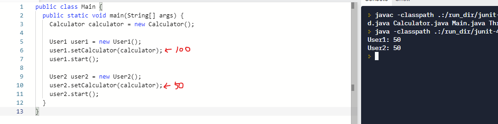

    * User1 스레드가 memory 필드에 100을 셋팅하고 2초간 sleep 상태일 때
    * User2 스레드가 memory 필드의 값을 50으로 변경한 경우이다
    * User1 스레드가 다시 실행상태가 되어서 memory 필드값을 출력하면 50이 나오게 된다

### 2. 동기화 메소드 및 동기화 블록
* 하나의 스레드가 동작할 때 다른 스레드가 간섭할 수 없어야하는 코드 영역을 `임계 영역(critical section)`이라고 한다
* 임계 영역을 지정하기 위해 동기화(synchronized) 메소드와 동기화 블록을 제공한다
    ```java
    public synchronized void method() {
        // 임계영역
    }

    public void method() {
        // 여러 스레드가 접근이 가능한 영역
        ...

        // 동기화 블럭
        synchronized(공유객체) {
            // 임계영역
        }

        // 여러 스레드가 접근이 가능한 영역
        ...
    }
    ```

* 임계 영역을 설정해서 다시 코드를 실행해보면
  
  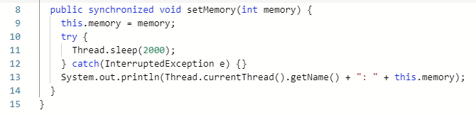
  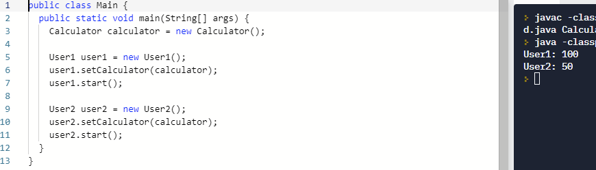

  * 동기화 블럭으로도 만들어서 임계영역을 설정할 수 있다

</br>

## 스레드 상태

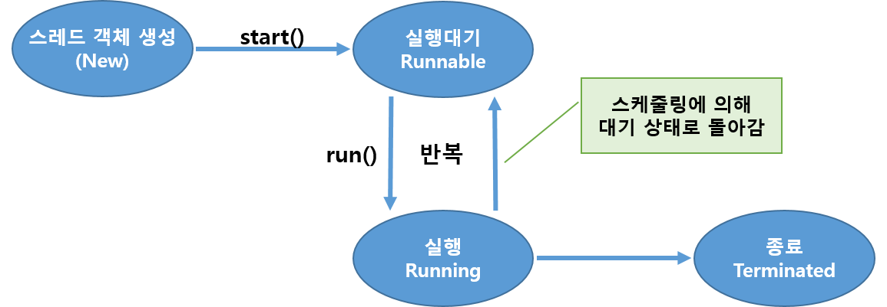
<table>
    <tbody>
        <tr>
            <th>상태</th>
            <th>열거 상수</th>
            <th>설명</th>
        </tr>
        <tr>
            <td>객체 생성</td>
            <td>NEW</td>
            <td>스레드 객체가 생성, 아직 start() 메소드가 호출 되지 않은 상태</td>
        </tr>
        <tr>
            <td>실행 대기</td>
            <td>RUNNABLE</td>
            <td>실행 상태로 언제든지 갈 수 있는 상태</td>
        </tr>
        <tr>
            <td rowspan="3">일시 정지</td>
            <td>WAITING</td>
            <td>다른 스레드가 통지할 때까지 기다리는 상태</td>
        </tr>
        <tr>
            <td>TIMED_WAITING</td>
            <td>주어진 시간 동안 기다리는 상태</td>
        </tr>
        <tr>
            <td>BLOCKED</td>
            <td>사용하고자 하는 객체의 락이 풀릴 때까지 기다리는 상태</td>
        </tr>
        <tr>
            <td>종료</td>
            <td>TERMINATED</td>
            <td>실행을 마친 상태</td>
        </tr>
    </tbody>
</table>
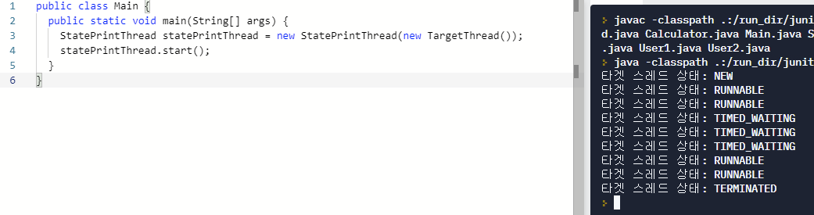

</br>

## 스레드 상태 제어
* 스레드 상태 변화 메소드

<table>
    <tbody>
        <tr>
            <th width="30%">메소드</th>
            <th width="70%">설명</th>
        </tr>
        <tr>
            <td width="30%">interrupt()</td>
            <td width="70%">일시 정지 상태의 스레드에서  Interrupted Exception 예외를 발생시켜 예외 처리 코드(catch)에서 실행 대기 상태로 가거나 종료 상태로 갈 수 있도록 한다</td>
        </tr>
        <tr>
            <td width="30%">notify()</br>notifyAll()</td>
            <td width="70%">동기화 블럭 내에서 wait() 메소드에 의해 일시 정지 상태에 있는 스레드를 실행 대기 상태도 변경</td>
        </tr>
        <tr>
            <td width="30%">resume</td>
            <td width="70%">suspend()메소드에 의해 일시정지 성태에 있는 스레드를 실행대기 상태로 만든다</br>- Deprecated(대신 notify(), notifyAll() 사용)</td>
        </tr>
        <tr>
            <td width="30%">sleep(long mills)</br>sleep(long mills, int nanos)</td>
            <td width="70%">주어진 시간 동안 스레드를 일시 정지 상태로 만든다. 주어진 시간이 지나면 자동적으로 실행 대기 상태가 된다</td>
        </tr>
        <tr>
            <td width="30%">join()</br>join(long mills)</br>wait(long mills, int nanos)</td>
            <td width="70%">동기화 블럭 내에서 스레드를 일시정지 상태로 만든다</br>매개값으로 주어진 시간이 지나면 자동적으로 실행대기 상태가 된다</br>시간이 주어지지 않으면 notify(), notifyAll() 메소드에 의해 실행대기 상태로 갈 수 있다</td>
        </tr>
        <tr>
            <td width="30%">suspend()</td>
            <td width="70%">스레드를 일시정지 상태로 만든다</br>resume() 메소드를 호출하면 다시 실행 대기 상태가 된다</br>- Deprecated(대신 wait() 사용)</td>
        </tr>
        <tr>
            <td width="30%">yield()</td>
            <td width="70%">실행 중 우선순위가 동일한 다른 스레드에게 실행을 양보하고 실행대기 상태가 된다</td>
        </tr>
        <tr>
            <td width="30%">stop()</td>
            <td width="70%">스레드를 즉시 종료시킨다 - Deprecated</td>
        </tr>
    </tbody>
</table>

</br>

## 데몬 스레드
* `데몬(daemon) 스레드`는 주 스레드의 작업을 돕는 보조적인 역할을 수행하는 스레드이다
* 주 스레드가 종료되면 데몬 스레드는 강제적으로 자동 종료 된다
* 데몬 스레드를 만들기 위해서는 주 스레드가 데몬이 될 스레드의 `setDaemon(true)`를 호출 해주면 된다
  * start() 메소드가 호출되고 나서 setDaemon(true)를 호출하면 IllegalThreadStateException이 발생하므로 start() 메소드 호출 전에 setDaemon(true)를 호출해야 한다

    ```java
    public static void main(String[] args) {
        AutoSaveThread thread = new AutoSaveThread();
        thread.setDaemon(true);
        thread.start();
        ...
    }
    ```

    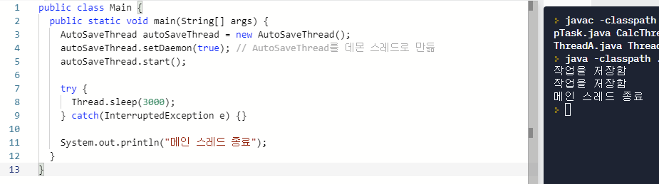

</br>

## 스레드 그룹
* `스레드 그룹(Thread Group)`은 관련된 스레드를 묶어서 관리할 목적으로 이용된다
* JVM이 실행되면 system 스레드 그룹을 만들고, JVM 운영에 필요한 스레드들은 생성해서 system 스레드 그룹에 포함시킨다
* 그리고 system의 하위 스레드 그룹으로 main을 만들고 메인 스레드를 main스레드 그룹에 포함시킨다
* 스레드는 반드시 하나의 스레드 그룹에 포함되는데 명시적으로 스레드 그룹에 포함시키지 않으면 기본적으로 자신을 생성한 스레드와 같은 스레드 그룹에 속한다

### 1. 스레드 그룹 이름 얻기
```java
ThreadGroup group = Thread.currentThread().getThreadGroup();
String groupName = group.getName();
```

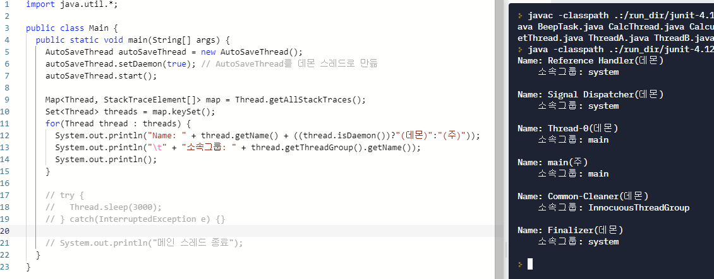

### 2. 스레드 그룹 생성
* 명시적으로 스레드 그룹 만들기
  ```java
  ThreadGroup tg = new ThreadGroup(String name);
  ThreadGroup tg = new ThreadGroup (ThreadGroup parent, String name);
  ```

  * 새로운 스레드 그룹을 생성한 후, 이 그룹에 스레드를 포함시키려면 Thread 객체를 생성하 ㄹ때 성성자 매개값으로 스레드 그룹을 지정하면 된다

### 3. 스레드 그룹의 일괄 interrupt()
* 스레드 그룹에서 제공하는 interrupt() 메소드를 이용하면 그룹 내에 포함된 모든 스레드들을 일괄 interrupt 할 수 있다
* 스레드 그룹의 interrupt() 메소드는 포함된 모든 스레드의 interrupt() 메소드를 내부적으로 호출해주기 때문이다
* 하지만 개별 스레드에서 발생하는 InterruptedException에 대한 예외처리는 하지 않는다
* 따라서 안전한 종료를 위해 개별 스레드가 예외 처리를 해야한다
* interrupt() 메소드로 스레드들을 안전하게 종료하도록 유도하는 것이 좋다

**ThreadGroup이 갖고 있는 주요 메소드**
<table>
    <tbody>
        <tr>
            <th colspan="2">메소드</th>
            <th>설명</th>
        </tr>
        <tr>
            <td>int</td>
            <td>activeCount()</td>
            <td>현재 그룹 및 하위 그룹에서 활동중인 모든 스레드의 수를 리턴</td>
        </tr>
        <tr>
            <td>int</td>
            <td>activeGroupCount()</td>
            <td>현재 그룹에서 활동 중인 모든 하위 그룹의 수를 리턴한다</td>
        </tr>
        <tr>
            <td>void</td>
            <td>checkAccess()</td>
            <td>현재 스레드가 스레드 그룹을 변경할 권한이 있는지 체크한다</br>만약 권한이 없다면 SecurityException을 발생시킨다</td>
        </tr>
        <tr>
            <td>void</td>
            <td>destroy()</td>
            <td>현재 그룹 및 하위 그룹을 모두 삭제한다</br>단, 그룹내에 포함된 모든 스레드들이 종료 상태가 되어야 한다</td>
        </tr>
        <tr>
            <td>boolean</td>
            <td>isDestroyed()</td>
            <td>현재 그룹이 삭제되었는지 여부를 리턴한다</td>
        </tr>
        <tr>
            <td>int</td>
            <td>getMaxPriority()</td>
            <td>현재 그룹에 포함된 스레드가 가질 수 있는 최대 우선순위를 리턴한다</td>
        </tr>
        <tr>
            <td>void</td>
            <td>setMaxPriority(int pri)</td>
            <td>현재 그룹에 포함된 스레드가 가질 수 있는 최대 우선순위를 설정한다</td>
        </tr>
        <tr>
            <td>String</td>
            <td>getName()</td>
            <td>현재 그룹의 이름을 리턴한다</td>
        </tr>
        <tr>
            <td>ThreadGroup</td>
            <td>getParent()</td>
            <td>현재 그룹의 부모 그룹을 리턴한다</td>
        </tr>
        <tr>
            <td>boolean</td>
            <td>parentOf(ThreadGroup g)</td>
            <td>현재 그룹이 매개값으로 지정한 스레드 그룹의 부모인지 여부를 리턴한다</td>
        </tr>
        <tr>
            <td>boolean</td>
            <td>isDaemon()</td>
            <td>현재 그룹이 대몬 그룹인지 여부를 리턴한다</td>
        </tr>
        <tr>
            <td>void</td>
            <td>setDaemon(boolean daemon)</td>
            <td>현재 그룹을 데몬 그룹으로 설정한다</td>
        </tr>
        <tr>
            <td>void</td>
            <td>list()</td>
            <td>현재 그룹에 포함된 스레드와 하위 그룹에 대한 정보를 출력한다</td>
        </tr>
        <tr>
            <td>void</td>
            <td>interrupt()</td>
            <td>현재 그룹에 포함된 모든 스레드들을 interrupt한다</td>
        </tr>
    </tbody>
</table>

</br>

## 스레드플
* 병렬 작업 처리가 많아지면 스레드 개수가 증가되고 그에 따른 스레드 생성과 스케줄링으로 인해 CPU가 바빠져 메모리 사용량이 늘어난다
* 갑작스런 병렬 작업 폭증으로 인한 스레드의 폭증을 막으려면 스레드풀(ThreadPool)을 사용해야 한다
* 스레드풀은 작업 처리에 사용되는 스레드를 제한된 개수만큼 정해 놓고 작업 큐(Queue)에 들어오는 작업들을 하나씩 스레드가 맡아 처리한다

### 1. 스레드풀 생성 및 종료
**스레드풀 생성**

|메소드명(매개 변수)|초기 스레드 수|코어 스레드 수|최대 스레드수|
|-----------------|-------------|-------------|-----------|
|newCachedThreadPool()|0|0|Integer.MAX_VALUE|
|newFixedThreadPool(int nThreads)|0|nThreads|nThreads|


**스레드풀 종료**
|리턴 타입|메소드명(매개 변수)|설명|
|--------|------------------|---|
|void|shutdown()|현재 처리 중인 작업뿐만 아니라 작업 큐에 대기하고 있는 모든 작업을 처리한 뒤에 스레드 풀을 종료 시킨다|
|List(Runnable)|shutdownNow()|현재 작업 처리 중인 스레드를 interrupt해서 작업 중지를 시도하고 스레드풀을 종료시킨다.</br>리턴값은 작업 큐에 있는 미처리된 작업(Runnable)의 목룍이다
|boolean|awaitTermination(long timeout, TimeUnit unit)|shutdown() 메소드 호출 이후, 모든 작업 처리를 timeout 시간 내에 완료하면 true를 리턴하고, 완료하지 못하면 작업 처리 중인 스레드를 interrupt하고 false를 리턴한다

### 2. 작업 생성과 처리 요청
**작업 생성**
* Runnable 구현 클래스
  ```java
  Runnable task = new Runnable() {
      @Override
      public void run() {
          // 스레드가 처리할 작업 내용
      }
  }
  ```
* Callable 구현 클래스
  ```java
  Callable<T> task = new Callable<T>() {
      @Override
      public T call() throws Exception {
          // 스레드가 처리할 작업 내용
          return T;
      }
  }
  ```

**처리 요청**
* 작업 처리 요청이란 ExecutorService의 작업 큐에 Runnable 또는 Callable 객체를 넣는 행위를 말한다

|리턴 타입|메소드명(매개 변수)|설명|
|--------|------------------|----|
|void|execute(Runnablke command)|- Runnable을 작업 큐에 저장</br>- 작업 처리 결과를 받지 못함|
|Futrue<?></br>Futre<V></br>Futrue<V>|submit(Runnable task)</br>submit(Runnable task, V result)</br>submit(Callable<V> task)|- Runnable 또는 Callable을 작업 큐에 저장</br>- 리턴된 Future를 통해 작업 처리 결과를 얻을 수 있음|

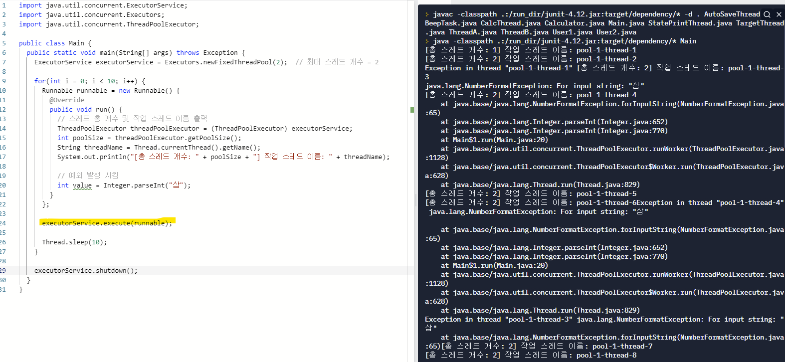
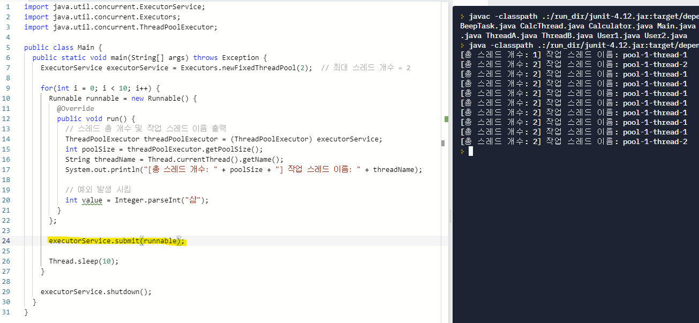

* execute()의 경우 예외 발생시 해당 스레드를 제거하고 새 스레드가 계속 생성된다
* submit()의 경우 예외가 발생하더라도 재사용된다

### 3. 블로킹 방식의 작업 완료 통보
<table>
    <tbody>
        <tr>
            <th>리턴 타입</th>
            <th>메소드명(매개 변수)</th>
            <th>설명</th>
        </tr>
        <tr>
            <td>Futrue<?></td>
            <td>submit(Runnable task)</td>
            <td rowspan="3">- Runnable 또는 Callable을 작업 큐에 저장</br>- 리턴된 Future를 통해 작업 처리 결과를 얻음</td>
        </tr>
        <tr>
            <td>Futrue<V></td>
            <td>submit(Runnable task, V result)</td>
        </tr>
        <tr>
            <td>Futrue<V></td>
            <td>submit(Callable<V> task)</td>
        </tr>
    </tbody>
</table>

</br></br>

### Reference
> 이것이 자바다 - 신용권 지음<br>
> kocw 운영체제 강의 - 이화여자대학교 반효경 교수님