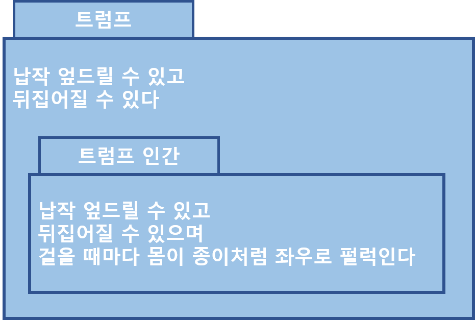
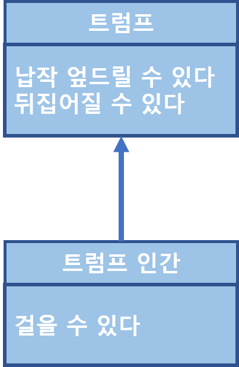

# 타입과 추상화
## 추상화를 통한 복잡성 극복
> 현실세계 예시로 지하철 노선도를 생각하면 된다

* `추상화`란 어떤 양상, 세부 사항, 구조를 좀 더 명확하게 이해하기 위해 특정 절차나 물체를 의도적으로 생략하거나 감춤으로써 복잡도를 극복하는 방법이다
    * 첫 번째 차원은 구체적인 사물들 간의 공통점은 취하고 차이점은 버리는 일반화를 통해 단순하게 만드는 것이다
    * 두 번째 차원은 중요한 부분을 강조하기 위해 불필요한 세부 사항을 제거함으로써 단순하게 만드는 것이다

### 그룹으로 나누어 단순화하기

### 개념
* 공통적인 특성을 기준으로 객체를 여러 그룹으로 묶어 동시에 다뤄야 하는 가짓수를 줄임으로써 상황을 단순화하려고 노력한다
* 이처럼 공통점을 기반으로 객체들을 묶기 위한 그릇을 `개념`이라고 한다
* 개념을 이용하면 객체를 여러 그룹으로 `분류`할 수 있다
* 객체에 어떤 개념을 적용하는 것이 가능해서 개념 그룹의 일원이 될 때 객체를 그 개념의 `인스턴스`라고 한다

### 개념의 세 가지 관점
* **심볼**: 개념을 가리키는 간략한 이름이나 명칭(ex. 트럼프)
* **내연**: 개념의 완전한 정의를 나타내며 내연의 의미를 이용해 객체가 개념에 속하는지 여부를 확인할 수 있다(ex. 특정 트럼프의 특징/설명)
* **외연**: 개념에 속하는 모든 객체의 집합(ex. 정원사, 병사, 신하, 왕자와 공주, 하트 잭 등)

### 객체를 분류하기 위한 툴
* `분류`란 객체에 특정한 개념을 적용하는 작업이다
* 객체에 특정한 개념을 적용하기로 결심했을 때 우리는 그 객체를 특정한 집합의 멤버로 분류하고 있는 것이다

 

## 타입
### 타입은 개념이다
* `타입`이란 우리가 인식하고 있는 다양한 사물이나 객체에 적용할 수 있는 아이디어나 관념을 의미한다
* 어떤 객체에 타입을 적용할 수 있을 때 그 객체를 타입의 인스턴스라고 한다
* 타입의 인스턴스는 타입을 구성하는 외연인 객체 집합의 일원이 된다

### 데이터 타입
* `데이터 타입`은 메모리 안에 저장된 데이터의 종류를 분류하는 데 사용하는 메모리 집합에 관한 메타데이터다
* 데이터에 대한 분류는 암시적으로 어떤 종류의 연산이 해당 데이터에 대해 수행될 수 있는지를 결정한다

### 행동이 우선이다
* 객체가 어떤 행동을 하느냐에 따라 객체의 타입이 결정된다
* 객체의 타입은 객체의 내부 표현과는 아무런 상관이 없다
* 객체지향 패러다임을 특징 짓는 중요한 몇가지 원리와 원칙에 의미를 부여
    * `다형성`이란 동일한 요청에 대해 서로 다른 방식으로 응답할 수 있는 능력 
        👉 동일한 메시지를 서로 다른 방식으로 처리하기 위해서는 객체들을 동일한 메시지를 수신할 수 있어야 하기 때문에 결과적으로 다형적인 객체들은 동일한 타입(또는 타입 계층)에 속하게 된다
    * `캡슐화`란 외부에 행동만을 제공하고 데이터는 행동 뒤로 감추는 것을 말한다

 

## 타입의 계층
### 일반화/특수화 관계
 

* 트럼프는 트럼프 인간을 포괄하는 좀 더 일반적인 개념이다
* 트럼프 인간은 트럼프보다 좀 더 특화된 행동을 하는 특수한 개념이다
* 일반화와 특수화는 동시에 일어난다
* 일반적 타입 = `슈퍼타입`
* 특수한 타입 = `서브타입`

* 서브타입은 슈퍼타입의 행위에 추가적으로 특수한 자신만의 행동을 추가하는 것이므로 슈퍼타입의 행동은 서브타입에게 자동으로 상속된다

 

## 정적 모델
### 타입의 목적
* 타입을 사용하는 이유는 시간에 따라 동적으로 변하는 객체의 복잡성을 극복하기 어렵기 때문이다
* 타입은 추상화다
    * 시간에 따른 객체의 상태 변경이라는 복잡성을 단순화할 수 있는 효과적인 방법인 것이다

### 동적 모델과 정적 모델
* 스냅샷 = 객체 다이어그램: 객체가 특정 시점에 구체적으로 어떤 상태를 가지느냐
* 동적 모델: 스냅샷처럼 실제로 객체가 살아 움직이는 동안 상태가 어떻게 변하고 어떻게 행동하는지를 포착하는 것
* 타입 모델: 객체가 가질 수 있는 모든 상태와 모든 행동을 시간에 독립적으로 표현하는 것
* 정적 모델: 동적으로 변하는 객체의 상태가 아니라 객체가 속한 타입의 정적인 모습을 표현

 
 

> 객체지향의 사실과 오해 - 조영호 지음