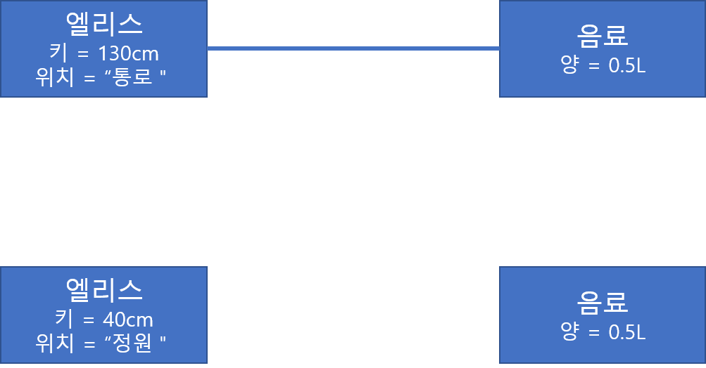

# 이상한 나라의 객체
## 객체, 그리고 이상한 나라
### 엘리스 객체
* 엘리스는 문을 통과하기 위한 적당한 상태가 되어야 하고 그 상태가 되도록 변화시키는 행동을 한다 
    👉 엘리스가 하는 행동에 따라 엘리스의 상태가 변하게 된다
* 엘리스가 집을 부숴버릴 정도로 커지거나 쐐기벌레를 올려봐야할 정도로 작아지더라도 엘리스는 그대로 엘리스 이다 
    👉 엘리스는 상태 변경과 무관하게 유일한 존재로 `식별 가능`하다
* 엘리스 특징
    * 엘리스는 상태를 가지며 상태는 변경 가능하다
    * 엘리스의 상태를 변경시키는 것은 엘리스의 행동이다
        * 행동의 결과는 상태에 의존적이며 상태를 이용해 서술할 수 있다
        * 행동의 순서가 결과에 영향을 미친다
    * 엘리스는 어떤 상태에 있더라도 유일하게 식별 가능하다

 

## 객체, 그리고 소프트웨어 나라
### 객체
* 식별 가능한 개체 또는 사물
* 구별 가능한 식별자, 특징적인 행동, 변경 가능한 상태를 가진다

### 상태
* 객체가 주변 환경과의 상호작용에 어떻게 반응하는가는 그 시점까지 객체에 어떤 일이 발생했느냐에 좌우된다
    * 자판기에 충분한 금액을 넣기 전에는 원하는 음료를 선택할 수 없다
* 상태를 이용하면 과거의 모든 행동 이력을 설명하지 않아도 행동의 결과를 쉽게 예측하고 설명할 수 있다

**상태와 프로퍼티**
* 프로퍼티(property) : 객체의 상태를 구성하는 모든 특징을 통틀어 이르는 말
    * 일반적으로 프로퍼티는 변경되지 않고 고정되기 때문에 '정적'이다
    * 프로퍼티 값은 시간이 흐름에 따라 변경되기 때문에 '동적'이다
      
    

    * `링크`는 객체 사이의 의미 있는 연결을 말한다
    * 연결되어 있지 않는 경우 협력이 불가능하다
    * `속성`은 객체를 구성하는 단순한 값

* 객체의 상태
    * 상태는 특정 시점에 객체가 가지고 있는 정보의 집합으로 객체의 구조적 특징을 표현한다
    * 객체의 상태는 객체에 존재하는 정적인 프로퍼티와 동적인 프로퍼티 값으로 구성된다
    * 객체의 프로퍼티는 단순한 값과 다른 객체를 참조하는 링크로 구분할 수 있다
* 객체는 스스로의 행동에 의해서만 상태가 변경되는 것을 보장함으로써 객체의 자율성을 유지한다

### 행동

**상태와 행동**
* 객체의 행동은 상태에 영향을 받는다
* 객체의 행동은 상태를 변경시킨다

**행동**
* 상호작용이 현재의 상태에 어떤 방식으로 의존하는가
* 상호작용이 어떻게 현재의 상태를 변경시키는가

**협력과 행동**
* `행동`이란 외부의 요청 또는 수신된 메시지에 응답하기 위해 동작하고 반응하는 활동이다
* 행동의 결과로 객체는 **자신의 상태를 변경하거나 다른 객체에게 메시지를 전달**할 수 있다
* 객체는 행동을 통해 **다른 객체와의 협력에 참여하므로 행동은 외부에 가시적**이어야 한다
* 객체의 행동으로 인해 1.객체 자신의 상태 변경   2.행동 내에서 협력하는 다른 객체에 대한 메시지 전송에 대한 부수효과를 명확하게 서술해야 한다

**상태 캡슐화**
* 객체지향 세계에서는 엘리스가 음료에게 _음료를 마셨다_ 라는 메시지를 전달할 수 있을 뿐이고 실제 음료의 양이 변하는 것은 메시지를 전달받은 음료 스스로이다
* 객체의 행동을 유발하는 것은 외부로부터 전달된 메시지지만 객체의 상태를 변경할지 여부는 객체 스스로 결정한다
* 캡슐화하는 것은 객체의 자율성을 높이고 협력을 단순하고 유연하게 만든다 👉 상태를 캡슐화 하는 이유

### 식별자

* `식별자`란 객체를 서로 구별할 수 있는 특정한 프로퍼티를 뜻한다
* 값이 같은지 여부는 상태가 같은지를 이용해 판단한고 이러한 판단을 할 수 있는 성질을 `동등성`이라고 한다
    * 상태를 이용해 동등성을 판단할 수 있는 이유는 값의 상태가 변하지 않기 때문이다
    * 이렇게 값은 오직 상태만을 이용해 동등성을 판단하기 때문에 인스턴스를 구별하기 위한 별도의 식별자를 필요로 하지 않는다
* 객체는 시간에 따라 변경되는 상태를 포함하며, 행동을 통해 상태를 변경한다
    * 두 객체의 상태가 다르더라도 식별자가 같다면 두 객체를 같은 객체로 판단할 수 있다 
        (어린시절의 나와 현재의 나는 상태는 다르지만 같은 동일 인물이다)
    * 식별자를기반으로 객체가 같은지를 판단할 수 있는 성질을 `동일성`이라고 한다

 

## 행동이 상태를 결정한다
**상태를 먼저 결정하는 것이 나쁜 영향을 미치는 이유**
* 캡슐화가 저해된다
    * 캡슐화되지 못하고 공용 인터페이스에 그대로 노출되버릴 확률이 높아진다
* 협력에 적합하지 못한 객체를 창조하게 된다
* 객체의 재사용성이 저하된다
* 어떤 책임이 필요한가를 결정하는 과정이 전체 설계를 주도해야한다
    * `책임-주도 설계(RDD)`는 협력이라는 문맥 안에서 객체의 행동을 생각하도록 도움으로써 응집도 높고 재사용 가능한 객체를 만들 수 있게 한다

 
 

> 객체지향의 사실과 오해 - 조영호 지음