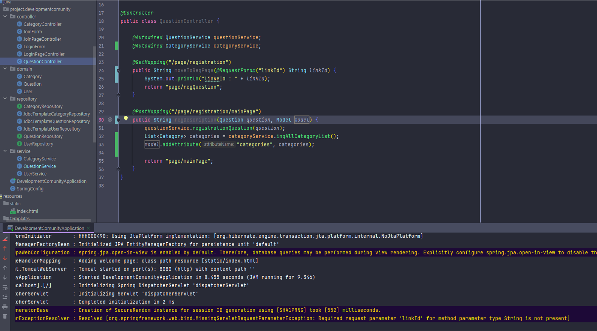

# Required request parameter 'linkId' for method parameter type String is not present

## 발생 원인



* 요청 쿼리 스트링에 'linkId' 필드가 없게 되면서
* `메소드 매개변수 유형 문자열에 대한 필수 요청 매개변수 'linkId'가 없다`<br/>
(Required request parameter 'linkId' for method parameter type String is not present)라는 오류가 발생했습니다

```html
<div>
    <form th:action="@{/page/registration/mainPage(linkId=${linkId}, idUser=${idUser})}" method="post">
        <div class="form-group">
            <label for="questionTitle">제목</label>
            <input type="text" id="questionTitle" name="questionTitle" placeholder="제목을 입력하세요"><br>
            <label for="description">내용</label>
            <textarea id="description" name="description" rows="10" placeholder="내용을 입력하세요"></textarea>
        </div>
        <button type="submit" id="btnSave">저장</button>
    </form>
</div>
```

* form태그에서 submit을 통해 linkId와 idUser 값을 보냈지만
* 사진에 나온 것처럼 @RequestParam 어노테이션을 통해서 받는 값이 없어 발생한 오류이다

### 정리할 내용
* **HTML에서 form태그를 통해 method가 POST로 전송이 되었고 따라서 @RequestParam으로 값을 받을 수 있다**
* GET 메서드, @GetMapping을 통해 localhost:8080?userId=1234&name=username 과 같은 형태로 전송되어 @RequestParm 어노테이션을 통해 해당 값들을 받는다
* 키값이 없는 경우, null을 허용하기 위해 `@RequestParameter(required = false)`를 추가하면 해당 값이 없어도 BadRequest가 발생하지 않는다
* 만약 값이 없는 경우, Default 값을 설정 하고 싶다면 `@RequestParameter(defaultValue = 1234)`와 같이 지정해 줄 수 있다
* Map을 통해서 많은 파라미터를 관리하고 required=false 없이도 예외 발생을 막을 수 있다
    * Map에 카값들을 등록해준다
    ```java
    @PostMapping("/page/registration/mainPage")
    public String regDescription(@RequestParm HashMap<String, Integer> parmMap) {
        ...
    }

    ```

## 해결
* 필수적으로 linkId와 idUser가 필요한 상황이라서 @RequestParameter를 선언해주었다
```java
@PostMapping("/page/registration/mainPage")
    public String regDescription(@RequestParam("linkId") long linkId, @RequestParam("idUser") long idUser, @Valid Question question, Model model) {
        question.setCategoryId(linkId);
        question.setUserId(idUser);
        
        ...
        ...

        return "page/mainPage";
    }

```