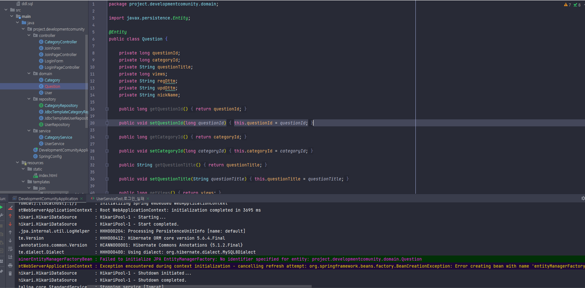
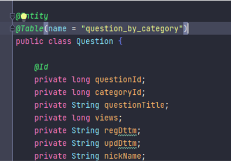

# No identifier specified for entity 에러 해결 방법

## 발생 원인
* No identifier specified for entity를 해석해보면 `엔티티에 대해 지정된 식별자가 없습니다`이다
* Question 클래스를 @Entity를 통해 엔티티로 지정을 했는데 해당 엔티디에서 식별자가 지정되지 않아서 오류가 발생했다

 

### 정리할 내용
* Entity는 데이터베이스에서 테이블 전체를 엔티티라고 한다
* 테이블에서 하나의 행이 엔티티 객체가 된다
* **@Entity**
    * 클래스가 하나의 엔티티임을 알려준다
* **@Id**
    * 엔티티에서 PK인 값을 지정해준다
* **@GeneratedValue**
    * PK가 자동으로 1씩 증가되도록 해준다

 

## 해결
* @Id 엔터티로 식별자 지정을 해줌
    * 막상 지정할때까지 단순히 오류 처리를 해결하기 위해서 하나 선언함
    * 실제 테이블에서 PK역할을 맡을 컬럼들에 @Id 어노테이션 지정을 해줘야 한다

