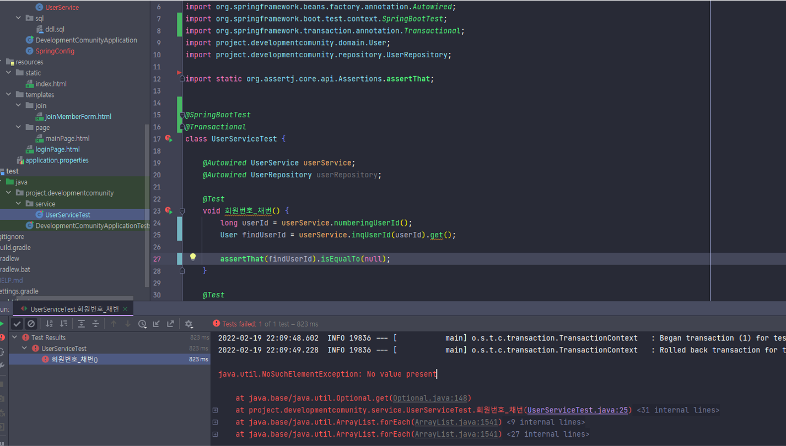

# SELECT에서 NVL을 통해 값이 없어도 0을 반환하게 했는데 NULL이 반환된 경우



* No value present → 값이 존재하지 않는다

```sql
SELECT NVL(MAX(USER_ID), 0)
FROM USER
```

* user_id의 최대값을 구하고 그 값이 null일때 `NVL 함수를 통해서 0을 반환`하게끔 쿼리를 작성 했지만 `No value present 오류 발생`을 했다

## 발생 원인
* 프로젝트를 하면서 사용한 Database의 종류는  MySQL이었다
* 검색을 통해 알게 된 사실
    * NVL 함수는 Oracle을 지원하고 MySQL을 지원하지 않는다
* 사용하는 Database에서 지원하지 않는 함수를 사용했기 때문에 NULL이 반환되어서 값이 없다는 오류를 받게 된 것이다

<br/>

### 정리할 내용
**NULL을 다른 값으로 대체**
1. Oracle
    * NVL(조회한 컬럼, 조회한 컬럼에 값이 없는 경우 대체할 값)
    * ex) NVL(SEQ, 0)
2. MySQL
    * IFNULL(조회한 컬럼, 조회한 컬럼에 값이 없는 경우 대체할 값)
    * ex) IFNULL(SEQ, 0)
3. 모든 데이터베이스
    * COALESCE(조회한 컬럼, 조회한 컬럼에 값이 없는 경우 대체할 값)
    * ex) COALESCE(SEQ, 0)

<br/>

## 해결
* 혼자 진행하는 사이드 프로젝트라 데이터베이스가 교체될 일은 없겠지만
* 데이터베이스의 종류가 바뀔수도 있다는 가정으로
* 모든 데이터베이스에서 사용되는 COALESCE 함수를 사용해서 오류를 해결했다

```sql
SELECT COALESCE(MAX(USER_ID), 0)
FROM USER
```