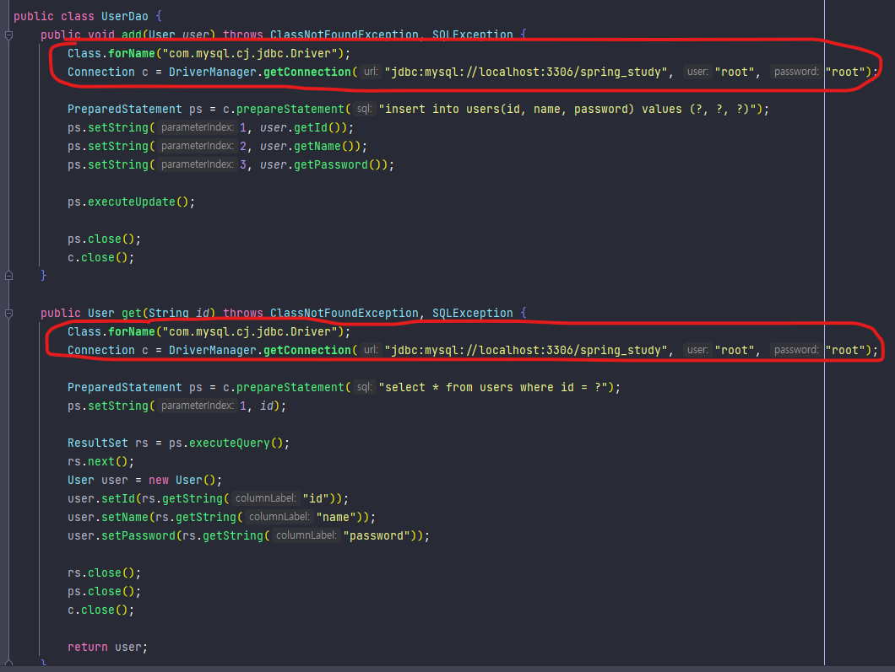

# 1.2 DAO의 분리
## 관심사의 분리
고객들의 요청으로 1.1에서 만든 DAO의 변경이 필요할 때 작업을 최소화하고 다른 곳에 영향을 주지 않기 위해서는 **분리와 확장** 을 고려한 설계를 해야한다

## 커넥션 만들기의 추출
### UserDao의 관심사항
1. DB연결
2. Statement를 만들고 DB를 통해 실행시키는 방법
3. 리소스 해제

#### 중복 코드의 메소드 추출



* 위에 예제에서 두 개의 메소드에서 DB 연결을 위해 동일한 소스 코드가 중복되었다
* 하나의 관심사가 무분별하게 중복되고 흩어져 있어서 다른 관심 대상과 얽혀 있으면, 변경이 일어날 때 엄청난 고통을 일으키는 원인이 된다
* 스파게티 코드가 된다

```java
/* UserDao
 *
 */
public class UserDao {
    public void add(User user) throws ClassNotFoundException, SQLException {
        Connection c = getConnection();
        
        PreparedStatement ps = c.prepareStatement(
            "insert into useers(id, name, password) values(?, ?, ?)");
        ps.setString(1, user.getId());
        ps.setString(2, user.getName());
        ps.setString(3, user.getPassword());
        
        ps.executeUpdate();
        
        ps.close();
        c.close();
    }
    
    public User get(String id) throws ClassNotFoundException, SQLException {
        Connection c = getConnection();
        
        PreparedStatement ps = c.prepareStatement(
                    "select * from users where id = ?");
        ps.setString(1, id);
        
        ResultSet rs = ps.executeQuery();
        rs.next();
        User user = new User();
        user.setId(rs.getString("id"));
        user.setsName(rs.getString("name"));
        user.setPassword(rs.getString("password"));
        
        rs.close();
        ps.close();
        c.close();
        
        return user;
    }
    
    private Connection getConnection() throws ClassNotFoundException, SQLException {
        Class.forName("com.mysql.jdbc.Driver");
        Connection c = DriverManager.getConnection(
            "jdbc:mysql://localhost/springbook", "spring", "book");
        return c;
    }
}
```

* DB의 연결이 변경된다면 1.1의 경우 add()메소드와 get()메소드에서 또는 그 이상의 많은 메소드에서 DB연결 정보를 변경해 줬어야 할 것이다
* 하지만 DB연결이라는 관심내용을 분리함으로써 getConnection() 메소드만 수정하면 DB연결을 변경할 수 있다
* 관심 내용이 독립적으로 존재하므로 수정도 간단해졌다

### 변경사항에 관한 검증: 리팩트링과 테스트
* 기존의 코드를 외부의 동작방식에는 변화 없이 내부 구조를 변경해서 재구성하는 것


## DB 커넥션 만들기의 독립
만약 여러 고객들이 UserDao를 사용하고 싶어한다</br>
그런데 고객들이 이용하고 싶은 DB의 종류가 다르고 각 고객마다 DB연결에 대해 변경이 있을 수 있다</br>
이런경우 UserDao를 어떻게 이용하도록 만들 수 있을까?

### 상속을 통한 확장
getConnection()을 추상메소드로 만들어 고객들이 UserDao를 상속받고 알맞게 getConnection()을 구현한다</br>
*추상메소드 : 자식 클래스에서 반드시 오버라이딩 해야한다*

```java
/* UserDao
 *
 */
public abtract class UserDao {
    public void add(User user) throws ClassNotFoundException, SQLException {
        Connection c = getConnection();
        
        PreparedStatement ps = c.prepareStatement(
            "insert into useers(id, name, password) values(?, ?, ?)");
        ps.setString(1, user.getId());
        ps.setString(2, user.getName());
        ps.setString(3, user.getPassword());
        
        ps.executeUpdate();
        
        ps.close();
        c.close();
    }
    
    public User get(String id) throws ClassNotFoundException, SQLException {
        Connection c = getConnection();
        
        PreparedStatement ps = c.prepareStatement(
                    "select * from users where id = ?");
        ps.setString(1, id);
        
        ResultSet rs = ps.executeQuery();
        rs.next();
        User user = new User();
        user.setId(rs.getString("id"));
        user.setsName(rs.getString("name"));
        user.setPassword(rs.getString("password"));
        
        rs.close();
        ps.close();
        c.close();
        
        return user;
    }
    
    public abstract Connection getConnection() throws ClassNotFoundExceptoin, SQLException;
}

/* NUserDao
 *
 */
public class NUserDao extends UserDao {
    public Connection getConnection() throws ClassNotFoundException, SQLException {
        // N사 DB connection 생성코드
    }
}
 
 
/* DUserDao
 *
 */
public class DUserDao extends UserDao {
    public Connection getConnection() throws ClassNotFoundException, SQLException {
        // D사 DB connection 생성코드
    }
}
```

* 클래스 계층구조를 통해 두개의 관심이 독립적으로 분리되면서 변경 작업이 용이해졌다
* UserDao 수정이 필요없이 고객들이 알맞게 DB연결을 수정할 수 있게 되었다
* **상속을 통해 손쉽게 확장을 했다**

#### 템플릿 메소드 패턴
* 기능의 일부를 추상 메소드나 오버라이딩이 가능한 protected 메소드 등으로 만든 뒤 서브클래스에서 이런 메소드를 필요에 알맞게 구현해 사용하도록 하는 방법
* **상속을 통해 슈퍼클래스의 기능을 확장** 할 때 사용하는 가장 대표적인 방법
* 변하지 않는 기능은 슈퍼클래스에 만들어두고 자주 변경되어 확장할 기능은 서브클래스에서 만들도록 한다

```java
public abstract class Super {
    public void templateMethod() {
        hookMethod();   // 훅 메소드 : 서브클래스에서 선택적으로 오버라이드 가능한 메소드
        abstractmethod();   // 추상 메소드 : 서브클래스에서 반드시 구현해야하는 메소드
    }
    
    protected void hookMethod() {}
    public abstract void abstractMethod();
}
```

#### 팩토리 메소드 패턴
* 서브클래스에서 구체적인 오브젝트 생성 방법을 결정하게 하는 것
* 상속을 통해 기능을 확장하는 패턴
* 주로 인터페이스 타입으로 오브젝트를 리턴한다
* 서브클래스에서 오브젝트 생성 방법과 클래스를 결정할 수 있도록 미리 정의해둔 메소드를 팩토리 메소드라 하고
* 이 방식을 통해 오브젝트 생성 방법을 슈퍼클래스의 기본 코드에서 독립시키는 방법

#### 상속을 사용했다는 단점
* 서로 독립적으로 변경 또는 확장할 수 있도록 만드는 것은 간단하면서도 매우 효과적인 방법이지만 **상속을 사용했다는 단점이 있다**
* 자바는 클래스의 다중상속이 지원되지 않는다 → 이미 UserDao가 다른 목적을 위해 상속을 사용하고 있으면 UserDao를 상속받아 사용할 수 없다
* 상속을 통한 상하위 클래스의 관계는 생각보다 밀접하다
* DB커넥션을 생성하는 코드를 다른 DAO 클래스에 적용할 수 없다

</br>

### Reference
> 토비의 스프링3.1 Vol.1 스프링의 이해와 원리 - 이일민 지음
